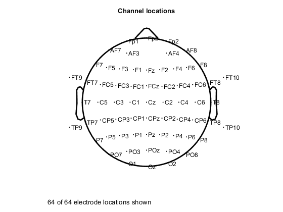
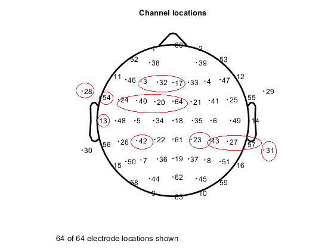

# Depression Detection and Scoring 

1. [Project Motivation](#motivation)
2. [Proposed Model](#proposedModel)
3. [Dataset Collection and Construction](#dataset)
4. [Current Achievement](#achievement)
5. [Future Plan](#futureplan)
6. [Contributors](#contributors)

## Project Motivation 
This BCI system is expected to be used as a complementary tool to monitor the depressive severity and the conventional treatments in hospitals and clinics.

## Proposed Model 

#### The illustration of Functional Brain Networks by Phase Synchronization. 

Red lines represent signifcant phase synchronization; blue lines represent signifcant phase desynchronization.

  

Li, Y., Kang, C., Qu, X., Zhou, Y., Wang, W., & Hu, Y. (2016). Depression-related brain connectivity analyzed by EEG event-related phase synchrony measure. Frontiers in human neuroscience , 10 , 477.

Li, Y., Kang, C., Wei, Z., Qu, X., Liu, T., Zhou, Y., & Hu, Y. (2017). Beta oscillations in major depression – signaling a new cortical circuit for central executive function. Scientific reports , 7 (1), 1-15.

#### The illustration of Functional Brain Networks by Phase Synchronization when Comparing Depressive Severities.

Clustering of some significantly increased and decreased phase synchronization indices mainly in beta bands for both the two depression groups and control groups. 

  

### Brain Funcitonal Networks by Granger Causility

this figure illustraed the result on using general partial derected coherence (GPDC) to construct the brain functional directed networks.

  

Kang, C., Li, Y., Novak, D., Zhang, Y., Zhou, Q., & Hu, Y. (2020). Brain Networks of Maintenance, Inhibition and Disinhibition During Working Memory. IEEE Transactions on Neural Systems and Rehabilitation Engineering, 28(7), 1518-1527.

### Residual Neural Networks for classifying deoression and scoring depressive severeties 

From this figure, we can catch the struture of the designed ResNet particularly adaptive to this above WM dataset.

  

Please refer to this papers:

Kang, C.et.al.(2021). CLASSIFYING AND SCORING MAJOR DEPRESSIVE DISORDER USING FREQUENCY BANDS, CHANNELS SELECTION WITH RESIDUAL NEURAL NETWORKS. (under review) 

##  Dataset Collection and Construction 

Downlowd the eeglab from https://eeglab.org/ and the SIFT toolbox https://github.com/sccn/SIFT/wiki

You can download the Woring Memory (WM) EEG data from https://drive.google.com/file/d/1PqFsi4QghR9A2JKFId4JM9fFbfvwcOSl/view?usp=sharing

## Formal Locations of Electrodes
Electrod location (Name) | Electrod location (Number)
------------ | -------------

 | 
 | 

## Current Achievement

The algorithm, which estimated by 10-fold CV, attained average accuracy rate ranging from 0.371 to 0.571, and achieved the average RMSE from 7.25 to 8.41. The best classifying result 0.871 and the smallest RMSE 2.80 are found when using beta frequency band and selected EEG channels.

## Future Plan

- Future works will mainly focus on the construction of further ANNs
- The EEG data acquisition and selection of depressive patients
- Longitudinal tracking, and the estimation of the antidepressant drug treatment.

## Contributors

Contributor | Email
------------ | -------------
Cheng Kang (康成) | kangchen@fel.cvut.cz
Yuezhi Li (李岳峙) | yzli@szu.edu.cn
Xujing Yao (姚旭婧) | xy147@leicester.ac.uk
Daniel Novak | xnovakd1@fel.cvut.cz
Yong Hu (胡勇) | yhud@hku.hk

